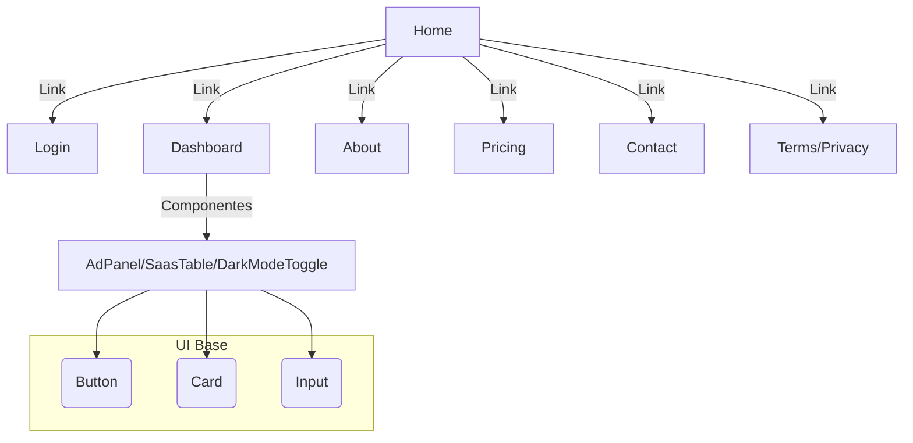

# 📊 AUDITORÍA FRONTEND STRATO — apps/frontend/src/

---

## 1. **📁 Estructura actual del frontend**

- **Carpetas principales:**
  - `app/`: Rutas Next.js (app router). Ej: `/`, `/about`, `/pricing`, `/dashboard`, `/login`, `/terms`, `/privacy`, `/contact`.
  - `components/`: 
    - `control-tower/`: Componentes clave de dashboard (AdPanel, SaasTable, DarkModeToggle).
    - `ui/`: Componentes reutilizables (Button, Card, Input).
    - `layout/`: Header y Footer.
  - `contexts/`: Contextos globales (AuthContext).
  - `types/`: Tipos TypeScript (ej. auth).
  - `tests/`: Tests utilitarios, mocks (MSW), y pruebas de UI.

- **Rutas implementadas:**
  - `/` (Home): Landing con hero, features y CTA.
  - `/about`, `/pricing`, `/terms`, `/privacy`, `/contact`: Páginas estáticas, con estructura y dark mode, pero contenido real pendiente (tienen TODO).
  - `/login`: Formulario de login/registro funcional, usa AuthContext.
  - `/dashboard`: Dashboard funcional, usa componentes de control-tower.

---

## 2. **📦 Módulos implementados vs pendientes (matriz STRATO)**

- **Implementados:**
  - **Dashboard**: Sí (con mock data y componentes avanzados).
  - **Auth**: Parcial (formulario y contexto, falta integración real con backend/Supabase).
  - **Control Tower**: Sí (AdPanel, SaasTable, DarkModeToggle).
  - **UI Base**: Sí (Button, Card, Input, Header, Footer).
  - **Páginas legales/info**: Estructura lista, contenido pendiente.

- **Pendientes/no existen:**
  - **Billing**: No hay módulo/ruta.
  - **Analytics**: No hay módulo/ruta específica (solo feature en landing).
  - **Campaigns**: No hay módulo/ruta.
  - **Deploy**: No existe.
  - **Docs**: No existe.
  - **Merge**: No existe.
  - **Settings**: No existe.
  - **Otros módulos SaaS**: No existen rutas ni componentes.

---

## 3. **✅ Componentes finalizados con tests y tipado correcto**

- `components/control-tower/AdPanel.tsx` (+ test)
- `components/control-tower/SaasTable.tsx` (+ test)
- `components/control-tower/DarkModeToggle.tsx` (+ test)
- `components/ui/Button.tsx`, `Card.tsx`, `Input.tsx` (+ tests)
- `contexts/AuthContext.tsx` (+ test)
- Páginas: `/`, `/about` (tienen test de render y estructura)
- **Todos los tests usan TypeScript estricto, sin `any`**

---

## 4. **❌ Componentes incompletos, duplicados o sin test**

- **Incompletos:**
  - Páginas `/about`, `/pricing`, `/terms`, `/privacy`, `/contact`: Solo estructura, contenido real pendiente (tienen TODO).
  - AuthContext: Falta integración real con Supabase/backend (solo mocks y fetch local).
- **No se detectan duplicados ni componentes huérfanos** (todos los componentes de control-tower y ui están en uso).
- **No existen tests para Footer/Header** (aunque son simples).
- **No existen tests para las páginas `/login`, `/dashboard`, `/contact`, `/terms`, `/privacy`, `/pricing`** (solo para `/` y `/about`).

---

## 5. **🧪 Estado de los tests frontend (por carpeta o módulo)**

- **Cobertura funcional:**
  - `components/control-tower/`: 100% cubierto con tests unitarios y de integración.
  - `components/ui/`: 100% cubierto con tests unitarios.
  - `contexts/`: AuthContext cubierto con tests de lógica y edge cases.
  - `app/`: Home (`/`) y About (`/about`) tienen tests de render y estructura. El resto de páginas no tiene tests.
  - `tests/`: Helpers, mocks (MSW), y pruebas básicas de utilidades.
- **No hay tests E2E ni de integración de flujos completos.**
- **No hay tests de accesibilidad (a11y) explícitos.**
- **No hay tests de integración real con backend (todo es mock/MSW).**

---

## 6. **🎨 Estado visual: ¿está bien diseñado? ¿hay consistencia UI?**

- **Consistencia:**  
  - Uso correcto de Tailwind, dark mode, fuentes y spacing.
  - Componentes UI reutilizables y bien estructurados.
  - Header y Footer presentes en todas las páginas.
  - Diseño limpio, profesional y responsive.
- **Accesibilidad:**  
  - Buen uso de roles, labels y estructura semántica en formularios y headings.
  - Falta validación a11y automatizada y tests de accesibilidad.
- **Pendiente:**  
  - Páginas estáticas con contenido real y copy profesional.
  - Mejorar feedback visual en errores de login/registro.
  - Agregar animaciones (Framer Motion no se detecta en uso real).

---

## 7. **🧩 Recomendaciones para completar el frontend (SaaS modular, escalable)**

**A. Modularidad y escalabilidad**
- Crear carpetas por módulo SaaS: `/billing`, `/analytics`, `/campaigns`, `/deploy`, `/docs`, `/merge`, `/settings`, etc.
- Cada módulo debe tener:
  - Página principal (`/app/<modulo>/page.tsx`)
  - Subcomponentes en `/components/<modulo>/`
  - Tests unitarios y de integración
  - Tipos en `/types/<modulo>.ts`
- Usar un layout modular para cada sección (ej: `dashboard/layout.tsx`).

**B. Tests**
- Agregar tests para todas las páginas y flujos críticos (login, dashboard, navegación).
- Incluir tests de accesibilidad (usando `@testing-library/jest-dom` y `axe`).
- Medir cobertura real (arreglar integración de coverage con Vitest).

**C. Integración real**
- Conectar AuthContext a Supabase (usando variables de entorno y helpers).
- Implementar MSW para simular endpoints de todos los módulos.
- Preparar mocks y factories para datos de pruebas.

**D. UI/UX**
- Completar contenido real en páginas estáticas.
- Añadir animaciones sutiles con Framer Motion (ej: transiciones de paneles, feedback de acciones).
- Mejorar feedback visual en formularios y errores.

**E. Arquitectura ideal para 10+ módulos SaaS**
- `/app/<modulo>/` para cada módulo, con layout propio si aplica.
- `/components/<modulo>/` para UI específica de cada módulo.
- `/contexts/<modulo>Context.tsx` para estado global de cada módulo.
- `/types/<modulo>.ts` para tipado estricto.
- `/tests/<modulo>/` para tests unitarios e integración.
- `/services/<modulo>.ts` para lógica de API y fetch.
- Mantener `/components/ui/` para UI base y reutilizable.
- Mantener `/components/layout/` para layout global.

---

## **RESUMEN VISUAL DE ESTADO**

---

## **PRIORIDADES INMEDIATAS**

1. **Completar contenido real en páginas estáticas.**
2. **Agregar tests para todas las páginas y flujos críticos.**
3. **Crear carpetas y rutas para módulos SaaS faltantes.**
4. **Conectar AuthContext a Supabase real.**
5. **Agregar animaciones y feedback visual.**
6. **Medir y mejorar cobertura de tests.**
7. **Agregar tests de accesibilidad.**

---

¿Quieres una propuesta de estructura de carpetas para 10+ módulos SaaS o un ejemplo de cómo escalar el dashboard? 